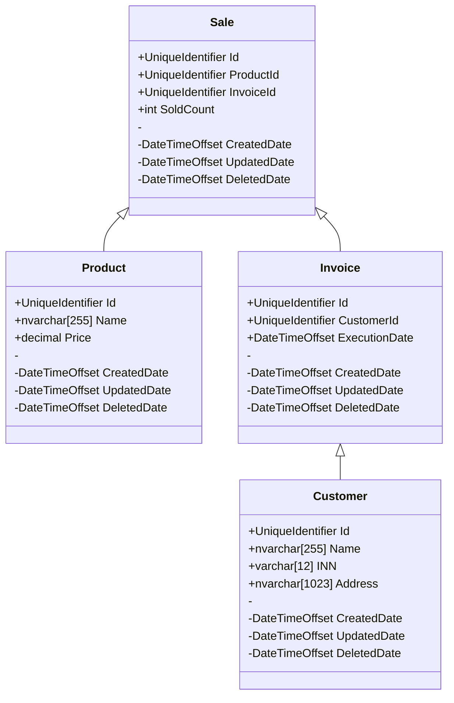

# Web API системы накладных Склада Гвоздей
### Маслова Т.Д. ИП-21-3 
#### Инструментальные средства разработки программного обеспечения

### Описание:

Покупатели могут заказать товары со склада гвоздей. Для этого составляется товарная накладная, которая включает в себя: Номер накладной, её дату исполнения,
данные покупателя (Наименование, ИНН, адрес), список покупаемых товаров, их итоговый налог и итоговую сумму.

### Шаблон готовой накладной: 


### Схема БД системы накладных Склада Гвоздей:
  


### SQL запросы добавления данных в БД:

```sql
TODO;
```
