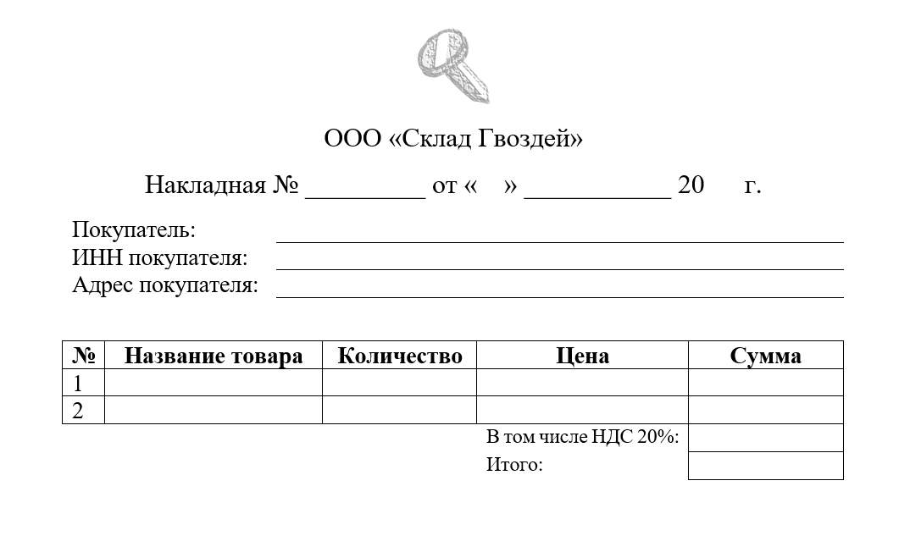
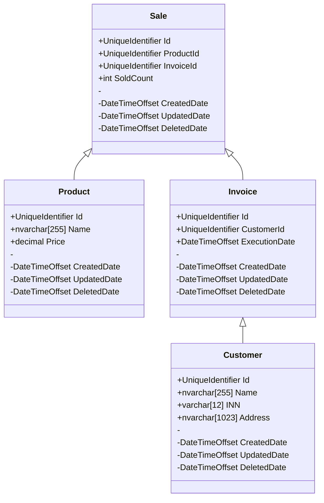

# Web API системы накладных Склада Гвоздей
### Маслова Т.Д. ИП-21-3 
#### Инструментальные средства разработки программного обеспечения

### Описание:

Покупатели могут заказать товары со склада гвоздей. Для этого составляется товарная накладная, которая включает в себя: Номер накладной, её дату исполнения,
данные покупателя (Наименование, ИНН, адрес), список покупаемых товаров, их итоговый налог и итоговую сумму.

### Шаблон готовой накладной: 



### Схема БД системы накладных Склада Гвоздей:
  


### SQL запросы добавления данных в БД:

```sql

INSERT INTO Customers (Id, Name, INN, Address, CreatedDate) VALUES ('33731362-6767-4852-af82-07b10d8c6160', N'ИП Уткин У.У.', '088005553535', N'Москва, пр. Мира, д. 198', '2024-12-24');
INSERT INTO Customers (Id, Name, INN, Address, CreatedDate) VALUES ('f0d9691d-855c-4901-b0e8-3ed9270c72ff', N'ОАО Ячмень', '123456789012', N'Ростов-На-Дону, ул. Уридского, д. 15', '2024-12-24');
INSERT INTO Customers (Id, Name, INN, Address, CreatedDate) VALUES ('4c9a836a-f29d-46db-a2d2-14d19a33c890', N'ИП Арбузова М.А.', '888999000111', N'Омск, ул. Энгельса, д. 13', '2024-12-24');
INSERT INTO Customers (Id, Name, INN, Address, CreatedDate) VALUES ('2dcbcb3f-743e-4502-b75b-6606bbd983ce', N'ООО СПС', '111222333444', N'Астрахань, ул. Мира, д. 4', '2024-12-24');

INSERT INTO Invoices(Id, CustomerId, ExecutionDate, CreatedDate) VALUES('83d22d07-d1d6-4c89-89a4-0dea0cfbe71e', '33731362-6767-4852-af82-07b10d8c6160', '2024-12-24', '2024-12-24');
INSERT INTO Invoices(Id, CustomerId, ExecutionDate, CreatedDate) VALUES('fc52d073-7771-42e0-aba4-437583de980d', '4c9a836a-f29d-46db-a2d2-14d19a33c890', '2025-02-14', '2024-12-24');

INSERT INTO Products(Id, Name, Price, CreatedDate) VALUES('dc6c3476-3f2d-4f63-9136-9c36b0ae20d0', N'Гвоздь Петушок', 300.0000, '2024-12-24');
INSERT INTO Products(Id, Name, Price, CreatedDate) VALUES('69d90a44-1a26-4113-9f0f-9da856126c82', N'Гвозди Сказка', 90.9000, '2024-12-24');
INSERT INTO Products(Id, Name, Price, CreatedDate) VALUES('bfba24b4-fc61-4849-9c94-63b84c576d21', N'Гвозди Морозец', 199.9000, '2024-12-24');
INSERT INTO Products(Id, Name, Price, CreatedDate) VALUES('c61d3a2f-053b-4eaa-b45b-1b43ad5f2d45', N'Гвозди Год Змеи', 2025.0000, '2024-12-24');
INSERT INTO Products(Id, Name, Price, CreatedDate) VALUES('e7ca6ca8-60c2-4ad3-97f0-5e9754a0303a', N'Гвоздь Мечта', 45.7800, '2024-12-24');

INSERT INTO Sales (Id, ProductId, InvoiceId, SoldCount, CreatedDate) VALUES ('7d689290-a1d2-4146-afa7-4f5806431bce', '69d90a44-1a26-4113-9f0f-9da856126c82', '83d22d07-d1d6-4c89-89a4-0dea0cfbe71e', '5', '2024-12-24');
INSERT INTO Sales (Id, ProductId, InvoiceId, SoldCount, CreatedDate) VALUES ('7fed28ae-7392-4e2b-8ae3-38ffbc8b4f50', 'c61d3a2f-053b-4eaa-b45b-1b43ad5f2d45', '83d22d07-d1d6-4c89-89a4-0dea0cfbe71e', '5', '2024-12-24');


```
