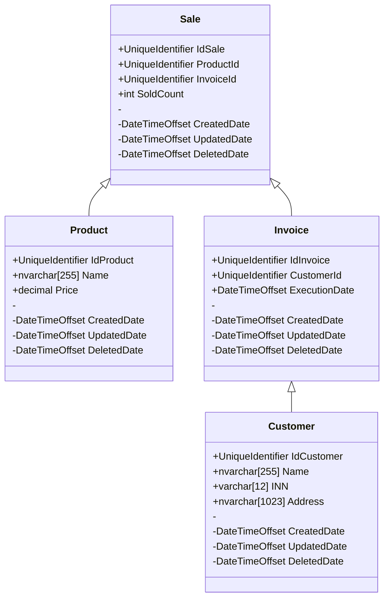

# Web API системы накладных Склада Гвоздей
### Маслова Т.Д. ИП-21-3 
#### Инструментальные средства разработки программного обеспечения

### Описание:

* Покупатели могут купить товары со склада гвоздей. Для этого составляется товарная накладная, которая включает в себя: Номер накладной, её дату исполнения,
данные покупателя (Наименование, ИНН, адрес), список покупаемых товаров, их итоговый налог и итоговую сумму.

* Для этого была разработана База Данных системы накладных Склада Гвоздей:

* Готовая накладная должна выглядеть так: 
